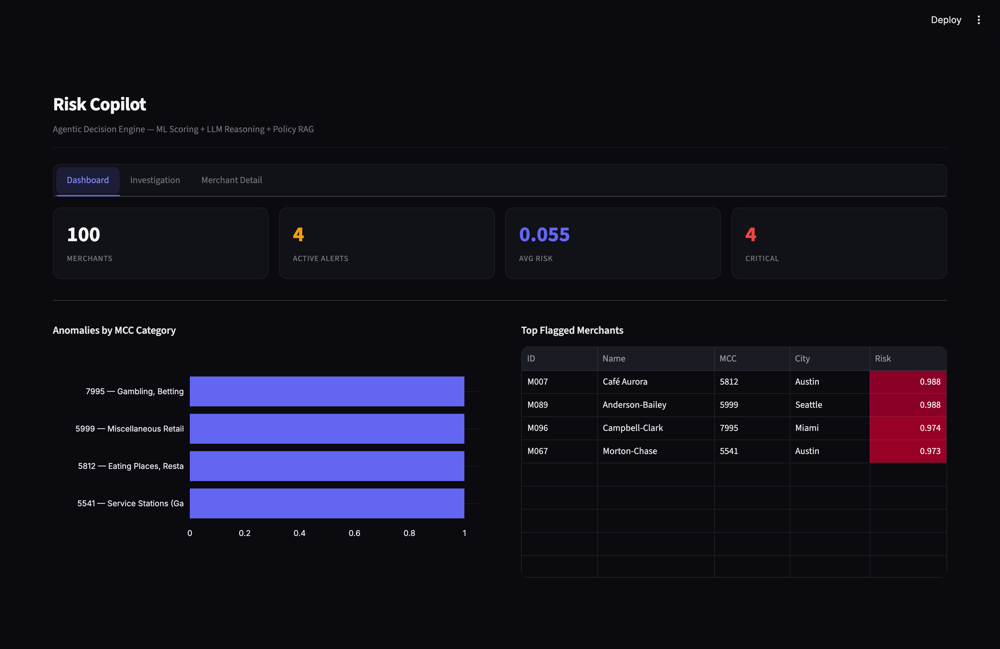
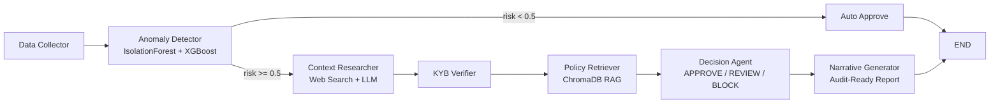

# 🛡️ Risk Copilot — Agentic Decision Engine for Merchant Risk

A multi-agent system that detects, investigates, and resolves merchant transaction anomalies using ML scoring + LLM reasoning — built with LangGraph.



## Architecture



**Key design**: ML models handle numerical scoring (IsolationForest + XGBoost). LLMs handle contextual reasoning, investigation, and narrative generation. A **Policy RAG node** (ChromaDB) retrieves relevant risk policies before the decision agent acts. The graph routes low-risk merchants to auto-approve, saving LLM tokens for cases that need investigation.

## Quick Start

```bash
# Clone and setup
git clone https://github.com/AstinSeverino/risk-copilot.git && cd risk-copilot
python -m venv venv && source venv/bin/activate
pip install -r requirements.txt

# Configure your API key (copy the template, then edit .env)
cp .env.example .env   # add your GOOGLE_API_KEY (free Gemini key)

# Generate data and train models
python -m src.data.generator
python -m src.ml.train

# Launch the UI
streamlit run app.py
```

## Demo Walkthrough: The Café Aurora Case

**Scenario**: Café Aurora (MCC 5812, Austin TX) normally processes ~80 txns/day. Today: **875 transactions** — a 10x spike.

**What the system does**:
1. **Data Collector** — Pulls 90 days of transaction history + 29 peer cafes for comparison
2. **Anomaly Detector** — Risk score: **0.988**, Peer z-score: **27.6σ** above peers
3. **Context Researcher** — Searches for local events, news, seasonal patterns
4. **KYB Verifier** — Business age: 587 days (OK), Sanctions: CLEAR, PEP: CLEAR
5. **Decision Agent** — Synthesizes all evidence → produces typed decision with reason codes
6. **Narrative Generator** — Creates audit-ready investigation report with counterfactual

**The insight**: The same architecture produces APPROVE (legitimate festival) or BLOCK (no explanation + suspicious patterns) based on evidence — not thresholds.

## Agent Graph (6 Nodes)

| Node | Type | Purpose |
|------|------|---------|
| `data_collector` | Python | Pull merchant data, transaction history, peer cohort |
| `anomaly_detector` | ML | Run IsolationForest + XGBoost, compute peer z-scores |
| `context_researcher` | LLM + Search | Search for external context explaining the anomaly |
| `kyb_verifier` | Python (stub) | Verify business age, MCC, sanctions/PEP |
| `policy_retriever` | RAG (ChromaDB) | Retrieve relevant risk policies for decision context |
| `decision_agent` | LLM + RAG | Synthesize evidence + policy context → APPROVE/REVIEW/BLOCK |
| `narrative_generator` | LLM | Generate audit-ready investigation narrative |

## ML Models

- **IsolationForest** — Unsupervised anomaly detection, zero labels needed (cold-start ready)
- **XGBoost** — Calibrated risk probability (0-1) with feature importances for explainability
- **15 engineered features**: volume/velocity, amounts, behavior, peer comparison, temporal, business age
- **Key metric**: PR-AUC 0.833 (not accuracy — fraud is <5% of data)

## Feature Catalog

| Feature | Description |
|---------|-------------|
| `peer_volume_zscore` | **Most important** — merchant volume vs same-MCC peers |
| `txn_count_24h/7d/30d` | Transaction velocity across windows |
| `volume_growth_ratio` | Today vs 30-day average |
| `customer_txn_ratio` | Unique customers / total txns (diversity signal) |
| `pct_card_present` | Card-present vs CNP (laundering signal) |
| `pct_international` | Foreign card percentage |
| `hour_entropy` | Transaction time distribution |
| `business_age_days` | Days since merchant registration |

## Evaluation

10 labeled test cases (5 legitimate, 5 suspicious) measuring exact match and directional correctness:

```bash
python -m src.evaluation.eval_suite
```

## Tech Stack

| Technology | Why |
|-----------|-----|
| **LangGraph** | Explicit graph = auditable control flow for compliance |
| **Gemini 2.5 Flash** | Free tier, fast, sufficient quality for reasoning nodes |
| **scikit-learn + XGBoost** | Industry standard for tabular risk scoring |
| **SQLite** | Zero-setup database for demo (PostgreSQL in production) |
| **Streamlit** | Rapid UI with native streaming support |
| **ChromaDB** | In-memory vector store for policy RAG |
| **Langfuse** | LLM observability and tracing (optional) |
| **DuckDuckGo Search** | Free web search, no API key needed |

## Production Architecture (What I'd Build With 3 Months)

### Data Layer
- **Kafka → Flink** for real-time transaction streaming
- **Feast feature store** for point-in-time correct feature serving
- **PostgreSQL + TimescaleDB** for merchant/transaction warehouse
- **S3 Object Lock** for immutable audit logs (7-year BSA/AMLD6 retention)

### ML Layer
- **MLflow** model registry with champion/challenger shadow deployment
- XGBoost trained on **confirmed fraud labels** (chargebacks, analyst resolutions)
- **GNN (GraphSAGE)** for fraud-ring detection via shared device/bank-account graphs
- Shadow mode: 30-60 day validation before production cutover

### Agent Layer
- LangGraph with **PostgresSaver** for durable execution
- **`interrupt()` HITL gate** on BLOCK/high-severity decisions
- **Claude Sonnet via Amazon Bedrock** (per client requirements)
- **NeMo Guardrails** for prompt injection prevention
- Cost budgets per agent run ($0.50 hard cap)

### Observability
- **Langfuse** for agent traces + prompt versioning
- **Datadog** for infrastructure metrics
- **Prometheus SLOs**: p95 decision latency < 800ms
- Automated regression testing on prompt changes via CI/CD

### Compliance
- **PCI DSS**: LLM never sees PAN/CVV — tokenized at edge
- **SR 11-7** model cards for every ML model and agent
- **FCRA** reason codes from closed taxonomy (13 defined codes)
- Adverse action letter templates auto-generated
- **EU AI Act**: Credit scoring = high risk, fraud/AML excluded (Recital 58)
- **DORA** for third-party AI vendor risk management

## Honest Caveats

- XGBoost uses **weak labels** (IsolationForest + rules) — production would use confirmed chargebacks
- KYB verifier is a **stub** — production would integrate Middesk, Alloy, or Sardine
- Synthetic data with **injected anomalies** — production connects to real transaction databases
- Multi-tenant isolation **not implemented**
- Single-model inference — production would use **ensemble** (XGBoost + LightGBM + CatBoost)

---

Built by **Astin Severino** — [LinkedIn](https://www.linkedin.com/in/astinseverino) · [GitHub](https://github.com/AstinSeverino)
